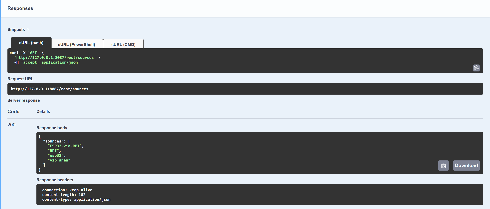
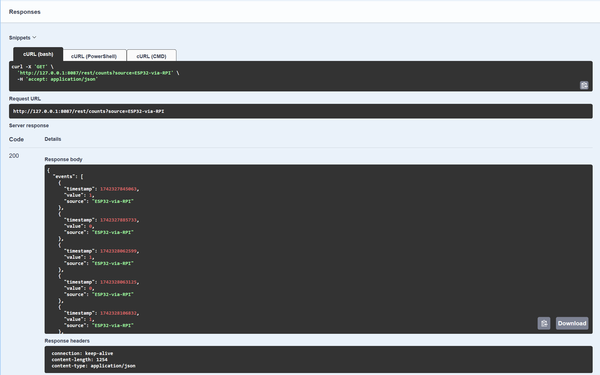
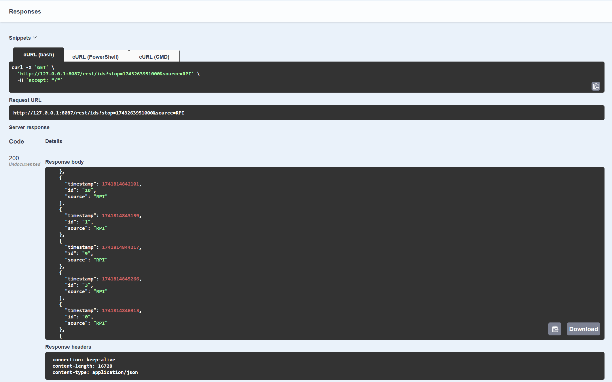
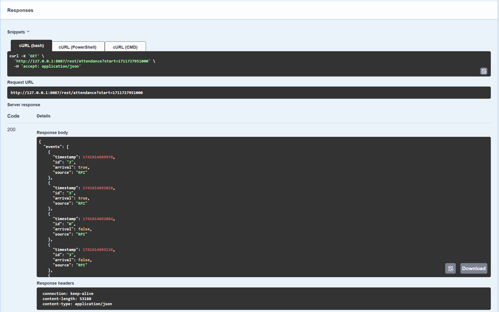
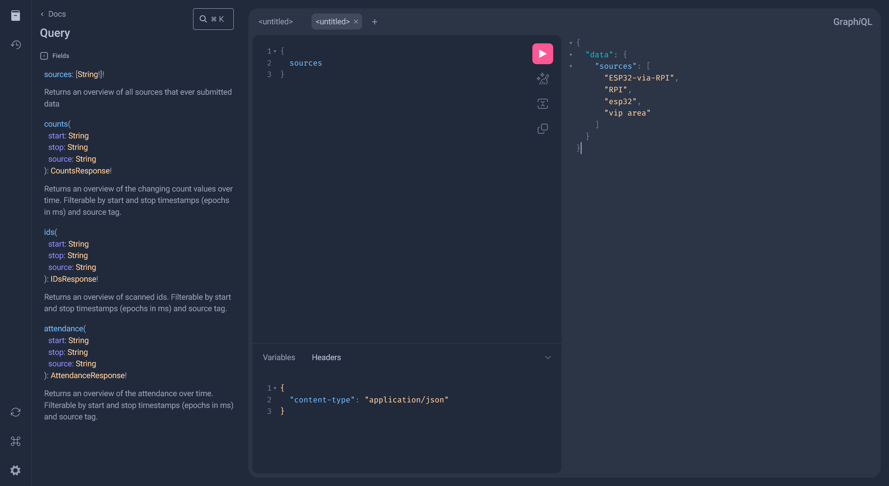
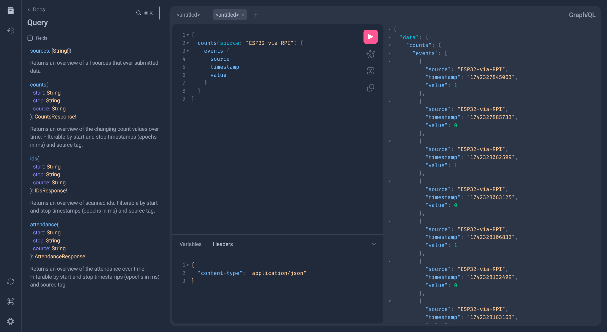
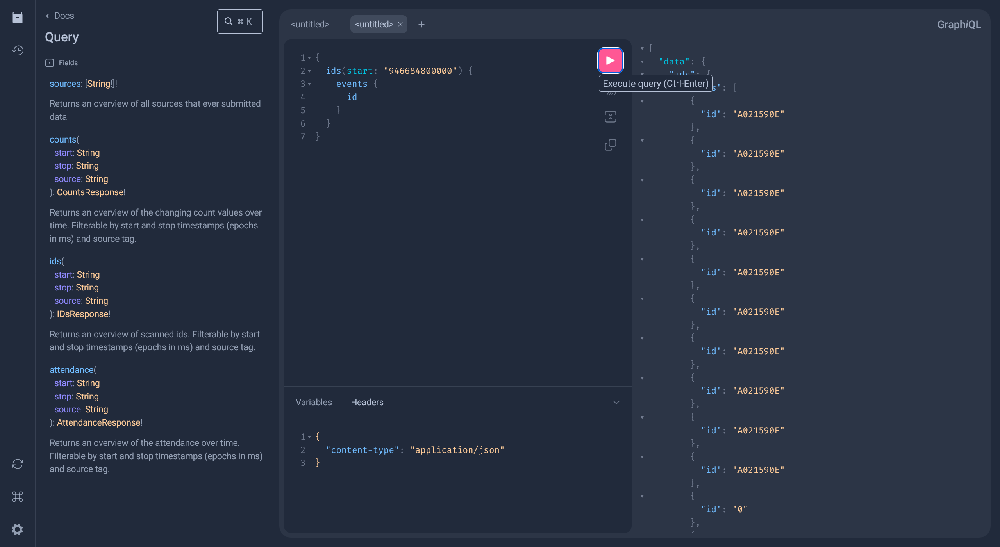
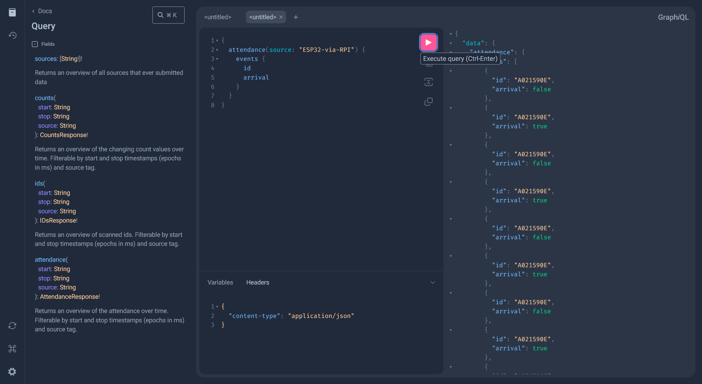
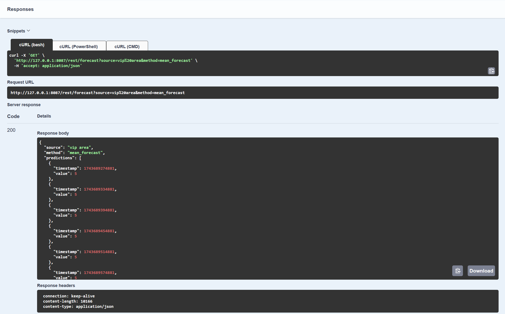

# Lab5 Egress: Part 1 - REST vs GraphQL
Lorin Speybrouck

## Remarks
When making the first task I found it frustrating that it was not obvious what a API route parameters where. For this purpose I implemented [Type-safe routing](https://ktor.io/docs/server-resources.html) with the ktor Resources plug in, this made it possible to define the name of parameters and query parameters and there type in a class. This is show in the following tasks. 

Another tool I missed was Swagger to easily visualise the API routes and test them. For this I added [Ktor OpenAPI Tools](https://smiley4.github.io/ktor-openapi-tools/latest/), this library can automatically generate OpenAPI documentation from code and also provides a route for the Swagger UI. This is also shown in the following task.


When developing the graphql endpoint I also missed a playground with auto generated documentation. For this I used graphiQL using the already used [GraphQL Kotlin](https://opensource.expediagroup.com/graphql-kotlin/docs/server/ktor-server/ktor-configuration/#graphiql-ide-route) library. This is show in task 2.

This all results in the following `base.kt` file
```kotlin
// base.kt file
fun Application.setup() {
	install(StatusPages) {
		exception<Throwable>(handler = ::onError)
		status(HttpStatusCode.NotFound, handler = ::onNotFound)
	}
	install(OpenApi) {
		schemas { generator = SchemaGenerator.kotlinx {} }
		autoDocumentResourcesRoutes = true
	}
	install(Resources)
	routing {
		trace {
			application.log.info("Incoming call: {}", it.call.request.uri.replace("\n", "\\n"))
		}
		get("/", {
			summary = "Index";
			description = "Hello world route"
			response { HttpStatusCode.OK to { body<String> {} } }
		}) {
			call.respond(HttpStatusCode.Companion.OK, "Hello world")
		}
		route("api.json") {
			openApi()
		}
		route("swagger") {
			swaggerUI("/api.json") { displayRequestDuration = true }
		}
	}
}
```

## Tasks
### Task 1: Implementing REST
#### Sources
`Result`


`Code`
```kotlin
// Sources.kt
@Serializable
data class SourcesResponse(
	val sources: List<String>
)

@Resource("sources")
class Sources(
)
fun Route.sources() {
	get<Sources>({
		summary="Get all sources"
		description = "Returns an overview of all sources that ever submitted data"
		response {
			HttpStatusCode.OK to { body<SourcesResponse> {} }
		}
	}) { _ ->
		val records = Influx.query(getSourcesFluxQuery())
		val foundSources = records.mapNotNull { record ->
			record.getValueByKey("source")?.toString()
		}

		call.respond(SourcesResponse(foundSources))
	}
}
```
The sources get request is the simplest query of all REST requests. Ith gets the data from the database using the sources Flux query and takes all sources values to return them in a SourcesResponse.

#### Counts
`Result`


`Code`
```kotlin
// Counts.kt
@Serializable
data class EventData(
	val timestamp: Long,
	val value: Int,
	val source: String
)
@Serializable
data class CountsResponse(
	val events: List<EventData>
)

@Resource("counts")
class Counts(
	val start: Long? = null,
	val stop: Long? = null,
	val source: String? = null
)
fun Route.counts() {
	get<Counts>({
		summary = "Get counts over time"
		description = "Returns an overview of the changing count values over time. Filterable by start and stop timestamps (epochs in ms) and source tag."
		response {
			HttpStatusCode.OK to { body<CountsResponse> {} }
		}
	}) { counts ->
		val start = if(counts.start != null) Instant.fromEpochMilliseconds(counts.start) else Defaults.start()
		val stop = if(counts.stop != null) Instant.fromEpochMilliseconds(counts.stop) else Defaults.stop()
		val source = counts.source

		val records = Influx.query( getCountFluxQuery(start, stop, source))
		val events = records.map { record ->
			EventData(
				timestamp = record.time?.toEpochMilli() ?: 0,
				value = record.value.toString().toInt(),
				source = record.getValueByKey("source")?.toString() ?: "unknown"
			)
		}

		call.respond(CountsResponse(events))
	}
}
```
The Counts get request first checks the provided query parameters to see if defaults need to be used. After this it gets its data from the database using the count Flux query. It returns the data in a CountsResponse which contains a list of EventData.

#### IDs
`Result`


`Code`
```kotlin
// IDs.kt
@Serializable
data class IDsResponse(
	val events: List<IDsEvent>
)
@Serializable
data class IDsEvent(
	val timestamp: Long,
	val id: String,
	val source: String
)

@Resource("ids")
class IDs(
	val start: Long? = null,
	val stop: Long? = null,
	val source: String? = null
)
fun Route.ids() {
	get<IDs>({
		summary="Get scanned ids overview"
		description = "Returns an overview of scanned ids. Filterable by start and stop timestamps (epochs in ms) and source tag."
		response {
			HttpStatusCode.OK to { body<IDsResponse> {} }
		}
	}) { ids ->
		val start = if(ids.start != null) Instant.fromEpochMilliseconds(ids.start) else Defaults.start()
		val stop = if(ids.stop != null) Instant.fromEpochMilliseconds(ids.stop) else Defaults.stop()
		val source = ids.source

		val records = Influx.query(getIDsFluxQuery(start, stop, source))
		val events = records.map { record ->
			IDsEvent(
				timestamp = record.time?.toEpochMilli() ?: 0,
				id = record.getValueByKey("_value")?.toString() ?: "unknown",
				source = record.getValueByKey("source")?.toString() ?: "unknown"
			)
		}

		call.respond(IDsResponse(events))
	}
}
```
The IDs query is similar to the Counts query but uses the get IDs Flux query.

#### Attendance
`Result`


`Code`
```kotlin
// Attendance.kt
@Serializable
data class AttendanceResponse(
	val events: List<AttendanceEvent>
)
@Serializable
data class AttendanceEvent(
	val timestamp: Long,
	val id: String,
	val arrival: Boolean,
	val source: String
)

@Resource("attendance")
class Attendance(
	val start: Long? = null,
	val stop: Long? = null,
	val source: String? = null
)
fun Route.attendance() {
	get<Attendance>({
		summary="Get attendance over time"
		description="Returns an overview of the attendance over time. Filterable by start and stop timestamps (epochs in ms) and source tag."
		response {
			HttpStatusCode.OK to { body<AttendanceResponse> {} }
		}
	}) { attendance ->
		val start = if(attendance.start != null) Instant.fromEpochMilliseconds(attendance.start) else Defaults.start()
		val stop = if(attendance.stop != null) Instant.fromEpochMilliseconds(attendance.stop) else Defaults.stop()
		val source = attendance.source

		val records = Influx.query(getAttendanceFluxQuery(start, stop, source))
		val events = records.map { record ->
			AttendanceEvent(
				timestamp = record.time?.toEpochMilli() ?: 0,
				id = record.getValueByKey("_value")?.toString() ?: "unknown",
				arrival = record.getValueByKey("arrival")?.toString()?.toBoolean() ?: false,
				source = record.getValueByKey("source")?.toString() ?: "unknown"
			)
		}
		call.respond(AttendanceResponse(events))
	}
}
```
The Attendance query is similar to the Counts query but uses the get attendance Flux query.

### Task 2: Implementing GraphQL
#### SourcesQueryService
`Result`

```graphql
{
	sources
}
```

`Code`
```kotlin
// SourcesQueryService.kt
class SourcesQueryService: Query {
	@GraphQLDescription("Returns an overview of all sources that ever submitted data")
	suspend fun sources() :List<String> {
		val records = Influx.query(getSourcesFluxQuery())
		val foundSources = records.mapNotNull { record ->
			record.getValueByKey("source")?.toString()
		}

		return foundSources
	}
}
```
The SourcesQueryService is adapted from the REST equivalent and only differs by directly returning the found sources.

#### CountsQueryService
`Result`

```graphql
{
  counts(source: "ESP32-via-RPI") {
	events {
	  source
	  timestamp
	  value
	}
  }
}
```

`Code`
```kotlin
// CountsQueryService.kt
@Serializable
data class EventData(
	val timestamp: String,
	val value: Int,
	val source: String
)
@Serializable
data class CountsResponse(
	val events: List<EventData>
)

class CountsQueryService: Query {
	@GraphQLDescription("Returns an overview of the changing count values over time. Filterable by start and stop timestamps (epochs in ms) and source tag.")
	suspend fun counts(
		start: String? = null,
		stop: String? = null,
		source: String? = null
	) : CountsResponse {
		val startInstant = try {
			if (start != null) Instant.fromEpochMilliseconds(start.toLong()) else Defaults.start()
		} catch (e: NumberFormatException) {
			throw IllegalArgumentException("Invalid start timestamp: $start. Expected a numeric value representing epoch time in ms")
		}
		val stopInstant = try {
			if (stop != null) Instant.fromEpochMilliseconds(stop.toLong()) else Defaults.stop()
		} catch (e: NumberFormatException) {
			throw IllegalArgumentException("Invalid stop timestamp: $stop. Expected a numeric value representing epoch time in ms")
		}

		val records = Influx.query( getCountFluxQuery(startInstant, stopInstant, source))
		val events = records.map { record ->
			EventData(
				timestamp = (record.time?.toEpochMilli() ?: 0).toString(),
				value = record.value.toString().toInt(),
				source = record.getValueByKey("source")?.toString() ?: "unknown"
			)
		}

		return CountsResponse(events)
	}
}
```
The CountsQueryService is also adapted from the REST equivalent. It differs in the type of timestamp query parameters, this is because graphQL can not use Long types. It only hase Int, Float, Double, String and scalar. To solve this strings are used and converted to long, with the necessary error handling. Then the count Flux query is called and the data is mapped and returned.

#### IDQueryService
`Result`

```graphql
{
  ids(start: "946684800000") {
	events {
	  id
	}
  }
}
```

`Code`
```kotlin
// IDQueryService.kt
@Serializable
data class IDsResponse(
	val events: List<IDsEvent>
)
@Serializable
data class IDsEvent(
	val timestamp: String,
	val id: String,
	val source: String
)

class IDQueryService: Query {
	@GraphQLDescription("Returns an overview of scanned ids. Filterable by start and stop timestamps (epochs in ms) and source tag.")
	suspend fun ids(
		start: String? = null,
		stop: String? = null,
		source: String? = null
	) : IDsResponse {
		val startInstant = try {
			if (start != null) Instant.fromEpochMilliseconds(start.toLong()) else Defaults.start()
		} catch (e: NumberFormatException) {
			throw IllegalArgumentException("Invalid start timestamp: $start. Expected a numeric value representing epoch time in ms")
		}
		val stopInstant = try {
			if (stop != null) Instant.fromEpochMilliseconds(stop.toLong()) else Defaults.stop()
		} catch (e: NumberFormatException) {
			throw IllegalArgumentException("Invalid stop timestamp: $stop. Expected a numeric value representing epoch time in ms")
		}

		val records = Influx.query(getIDsFluxQuery(startInstant, stopInstant, source))
		val events = records.map { record ->
			IDsEvent(
				timestamp = (record.time?.toEpochMilli() ?: 0).toString(),
				id = record.getValueByKey("_value")?.toString() ?: "unknown",
				source = record.getValueByKey("source")?.toString() ?: "unknown"
			)
		}

		return IDsResponse(events)
	}
}
```
The IDQueryService is similar to the CountsQueryService.

#### AttendanceQueryService
`Result`

```graphql
{
	attendance(source: "ESP32-via-RPI") {
	events {
	  id
	  arrival
	}
  }
}
```

`Code`
```kotlin
// AttendanceQueryService.kt
@Serializable
data class AttendanceResponse(
	val events: List<AttendanceEvent>
)
@Serializable
data class AttendanceEvent(
	val timestamp: String, // Long is not supported in GraphQL
	val id: String,
	val arrival: Boolean,
	val source: String
)
class AttendanceQueryService: Query {
	@GraphQLDescription("Returns an overview of the attendance over time. Filterable by start and stop timestamps (epochs in ms) and source tag.")
	suspend fun attendance(
		start: String? = null,
		stop: String? = null,
		source: String? = null
	): AttendanceResponse  {
		val startInstant = try {
			if (start != null) Instant.fromEpochMilliseconds(start.toLong()) else Defaults.start()
		} catch (e: NumberFormatException) {
			throw IllegalArgumentException("Invalid start timestamp: $start. Expected a numeric value representing epoch time in ms")
		}
		val stopInstant = try {
			if (stop != null) Instant.fromEpochMilliseconds(stop.toLong()) else Defaults.stop()
		} catch (e: NumberFormatException) {
			throw IllegalArgumentException("Invalid stop timestamp: $stop. Expected a numeric value representing epoch time in ms")
		}

		val records = Influx.query(getAttendanceFluxQuery(startInstant, stopInstant, source))
		val events = records.map { record ->
			AttendanceEvent(
				timestamp = (record.time?.toEpochMilli() ?: 0).toString(),
				id = record.getValueByKey("_value")?.toString() ?: "unknown",
				arrival = record.getValueByKey("arrival")?.toString()?.toBoolean() ?: false,
				source = record.getValueByKey("source")?.toString() ?: "unknown"
			)
		}
		return AttendanceResponse(events)
	}
}
```
The AttendanceQueryService is similar to the CountsQueryService.

### Task 3: Add Egress API to Your Microservices Architecture
The Egress API was successfully deployed on the cloud to this url: [Egress](https://egress.daellhin.cloudandmobile.ilabt.imec.be/). This was done by following the same steps as lab 3.

### Optional Task 4: Differences between GraphQL and REST
Unfinished

### Task 5: Obtaining forecasts
`Code`
```kotlin
// Model.kt
suspend fun predict(
	inputStart: Instant,
	inputStop: Instant,
	source: String,
	method: String
): Result<List<Pair<Instant, Int>>> {
	val records = Influx.query(getCountFluxQuery(inputStart, inputStop, source))
	if (records.isEmpty())
		return Result.success(emptyList())

	val counts = records.map { record -> record.value.toString().toInt() }.takeLast(200)
	val timestamps = records.map { record -> record.time?.toEpochMilli() ?: 0 }.takeLast(200)

	return try {
		val requestBody = PredictionRequest(timestamps, counts)
		val response = client.post("$url/$method") {
			contentType(ContentType.Application.Json)
			setBody(requestBody)
		}

		val responseBody = response.body<PredictionResponse>()
		val predictions = responseBody.timestamps.zip(responseBody.counts) { timestamp, count ->
			Pair(Instant.fromEpochMilliseconds(timestamp), count)
		}

		Result.success(predictions)
	} catch (e: Exception) {
		LOGGER.error("Failed to get predictions: ${e.message}")
		Result.failure(e)
	}
}
```
Forecasts are created using the Counts query. From the results counts and timestamps are extracted. (These are limited because too many results give problems with the JSON serializer). After this a PredictionRequest is created using the timestamps and counts as separate lists. The PredictionResponse is then mapped to a list of pairs of timestamp and count, which are then returned.

### Task 6: Scheduling and caching forecasts
`Code`

```kotlin
// ServiceSyncJob.kt
fun start() {
	if (job != null) 
		return
	
	job = scope.launch {
		while (isActive) {
			try {
				val now = Clock.System.now()
				val result = Model.predict(begin, now, source, method)
				result.fold(
					onSuccess = { predictions ->
						if (predictions.isNotEmpty())
							ServiceCache.put(method, source, predictions)
						LOGGER.info("Stored ${predictions.size} predictions in cache for source: $source, method: $method")
						begin = now
					},
					onFailure = { error ->
						LOGGER.error("Failed to get predictions: ${error.message}")
					}
				)
			} catch (e: Exception) {
				if (e is CancellationException) throw e
				LOGGER.error("Error in sync job: ${e.message}", e)
			} finally {
				delay(syncDelay)
			}
		}
	}
}
```
In the ServiceSyncJob a job is created that calls the function created in the previous task. The results of this are put into the service cache, this happens for every . After this the job waits for syncDelay, before repeating.

### Task 7: GETting forecasts
`Result`


`Code`
```kotlin
// Forecasts.kt
@Serializable
data class PredictionData(
	val timestamp: Long,
	val value: Int
)

@Serializable
data class ForecastResponse(
	val source: String,
	val method: String,
	val predictions: List<PredictionData>
)

@Resource("forecast")
class Forecast(
	val time: Long? = null,
	val source: String,
	val method: String
)
fun Route.forecast() {
	get<Forecast>({
		summary="Get the forecast for a given source and method"
		description="Returns the best fitting forecast given the timestamp`time` (epochs in ms) or using default value Clock.System.now(), according to the provided source value (tag)"
		response {
			HttpStatusCode.OK to { body<ForecastResponse> {} }
		}
	}) { forecast ->
		val timeInstant = if(forecast.time != null) Instant.fromEpochMilliseconds(forecast.time) else Clock.System.now()
		val source = forecast.source
		val method = forecast.method

		val predictions = ServiceCache.get(method, source, timeInstant)
		if (predictions.isNullOrEmpty()) {
			throw  IllegalArgumentException("No predictions available for the given source: $source and method: $method")
		}
		val formattedPredictions = predictions.map { pair ->
			PredictionData(pair.first.toEpochMilliseconds(), pair.second)
		}

		call.respond(
			ForecastResponse(
				source = source,
				method = method,
				predictions = formattedPredictions
			)
		)
	}
}
```
In the forecasts get requests the cache, which is filled in the previous task, is queried for an appropriate prediction given the passed query parameters. The prediction is then returned in a ForecastResponse.

## Questions
### Question 1
> Why is it useful to expose the same content (same fields) from both REST and GraphQL queries?

This gives the consumer of the API choice. REST queries contain a lot of information and when a user needs all of this information this will be the fastest way. But if the consumer needs only limited data or needs the data to answer further queries(multiple back and forth calls) GraphQL will be faster, despite its higher overhead.

### Question 2
> Define the four GraphQL services using the GraphQL Schema Definition Language (SDL). If you need help doing this, here is a good explanation and examples of the SDL.

An advantage of the approach I took is that this is generated automatically.
```graphql
schema {
  query: Query
}

type Query {
  "Returns an overview of the attendance over time. Filterable by start and stop timestamps (epochs in ms) and source tag."
  attendance(source: String, start: String, stop: String): AttendanceResponse!
  "Returns an overview of the changing count values over time. Filterable by start and stop timestamps (epochs in ms) and source tag."
  counts(source: String, start: String, stop: String): CountsResponse!
  "Returns an overview of scanned ids. Filterable by start and stop timestamps (epochs in ms) and source tag."
  ids(source: String, start: String, stop: String): IDsResponse!
  "Returns an overview of all sources that ever submitted data"
  sources: [String!]!
}
type AttendanceEvent {
  arrival: Boolean!
  id: String!
  source: String!
  timestamp: String!
}
type AttendanceResponse {
  events: [AttendanceEvent!]!
}
type CountsResponse {
  events: [EventData!]!
}
type EventData {
  source: String!
  timestamp: String!
  value: Int!
}
type IDsEvent {
  id: String!
  source: String!
  timestamp: String!
}
type IDsResponse {
  events: [IDsEvent!]!
}
```

### Question 3
> The forecasting job system helps with improving the egress’ response time when querying forecasting results. Give two more reasons why scheduling and/or caching these requests/results is beneficial.

- Efficiency: running the forecast query takes a lot of system resources(AI model), these resources can be better used for responding to actual api requests 
- Consistency: by caching the result multiple users will get the same answer, otherwise they would get different data becaus a AI model contains randomness

# Lab5 Egress: Part 2 - Securing Web Services
Lorin Speybrouck

## Tasks
### Task 1: Configure JWT
`Code`
```kotlin
// Auth.kt
private fun Application.configureAuth() {
    install(Authentication) {
        jwt("auth-jwt") {
            verifier(
                JWT
                    .require(Algorithm.HMAC256(SessionManager.secret))
                    .withIssuer(SessionManager.issuer)
                    .withAudience(SessionManager.audience)
                    .build()
            )
            validate { credential ->
                if (credential.payload.getClaim("username").asString().isNotEmpty()) 
                    JWTPrincipal(credential.payload)
                 else 
                    null
            }
            challenge { _, _ ->
                call.respond(
                    status = HttpStatusCode.Unauthorized,
                    message = "Invalid or missing token"
                )
            }
        }
    }
}
```
In the first task the verifier, validate and challenge functions have been completed. 
- **verifier**: The verifier function configures the JWT validation by specifying the expected algorithm, issuer, and audience for incoming tokens.
- **validate**: The validate function checks if the JWT contains a non-empty "username" claim and, if so, authenticates the user by creating a JWTPrincipal.
- **challenge**: The challenge function defines the response sent to the client when authentication fails, returning an HTTP 401 Unauthorized status with an error message.

### Task 2: Add a registration endpoint
`Result:` successful registration


`Result:` already registered


`Code`
```kotlin
// Auth.kt
post("/register") {
	val credentials = call.receive<SessionManager.Credentials>()
	val result = SessionManager.createAccount(credentials)

	result.fold(
		onSuccess = {
			call.respond(HttpStatusCode.Created, "Account created successfully")
		},
		onFailure = { exception ->
			when (exception) {
				is SessionManager.AlreadyExists -> call.respond(HttpStatusCode.Conflict, "Username already taken")
				else -> call.respond(HttpStatusCode.InternalServerError, "Failed to create account")
			}
		}
	)
}
```
```kotlin
// SessionManager.kt
suspend fun createAccount(credentials: Credentials): Result<Unit> {
	LOGGER.info("Incoming register attempt for `${credentials.username}`")
	return try {
		// Check if the username already exists in the database
		val userExists = UserManager.check(credentials.username, credentials.password)
		if (userExists)
			return Result.failure(AlreadyExists)

		// Create the user account in the database
		UserManager.create(credentials.username, credentials.password)
		Result.success(Unit)
	} catch (e: Exception) {
		LOGGER.error("Error creating account for `${credentials.username}`: ${e.message}")
		Result.failure(e)
	}
}
```
When the register POST endpoint is called the function gets the credentials from the body, and passes them to the SessionManager to create a account. If this is successful the response is a create HTTP status code and a succes message. If unsuccessful the error is reported, either it conflicts wit a existing account, or there was a server error.

In the create account function we first check with the UserManager if an account with the specified credentials exists. If not a account is created.

### Task 3: Add a login endpoint
`Result:` successful login


`Result:` not registered


`Code`
```kotlin
// Auth.kt
post("/login") {
	val credentials = call.receive<SessionManager.Credentials>()
	val result = SessionManager.processLogin(credentials)

	result.fold(
		onSuccess = { token ->
			call.respond(HttpStatusCode.OK, token)
		},
		onFailure = { exception ->
			when (exception) {
				is SessionManager.InvalidCredentials -> call.respond(HttpStatusCode.Unauthorized, "Invalid credentials")
				else -> call.respond(HttpStatusCode.InternalServerError, "Failed to process login")
			}
		}
	)
}
```
```kotlin
// SessionManager.kt
suspend fun processLogin(credentials: Credentials): Result<Token> {
	LOGGER.info("Incoming login attempt for `${credentials.username}`")
	return try {
		val isValid = UserManager.check(credentials.username, credentials.password)
		if (!isValid) {
			return Result.failure(InvalidCredentials)
		}

		val token = JWT.create()
			.withIssuer(issuer)
			.withAudience(audience)
			.withClaim("username", credentials.username)
			.withExpiresAt(Date(System.currentTimeMillis() + expiry))
			.sign(Algorithm.HMAC256(secret))

		Result.success(Token(token))
	} catch (e: Exception) {
		LOGGER.error("Error during login for `${credentials.username}`: ${e.message}")
		Result.failure(e)
	}
}
```
When the login POST endpoint is called the function gets the credentials from the body, and passes them to the SessionManager to verify. If successful the JWT token is returned. If unsuccessful the reason is returned, invalid credentials, or server error.

In The processLogin function the credentials are checked in the database using the UserManager. If successful a JWT token will be created using HMAC256 for the given username.

### BONUS Task 4: Implement IP ban or backoff to prevent attacks
`Code`
```kotlin
// Backoff.kt
val BackoffPlugin = createApplicationPlugin("BackoffPlugin") {
    onCall { call ->
        // Check if the host is rate-limited
        if (RateLimiter.isRateLimited(call)) {
            call.respond(HttpStatusCode.TooManyRequests, "You are temporarily banned due to repeated invalid requests.")
            return@onCall
        }
    }
    onCallRespond { call, statusCode ->
        // Observe responses and handle bad calls
        if (statusCode == HttpStatusCode.Unauthorized || statusCode == HttpStatusCode.BadRequest) {
            RateLimiter.onBadCallMade(call)
        }
    }
}
```
In the onCall function of the BackoffPlugin RateLimiter determines if the user is rate limited. If this is the case the function responds with a message with TooManyRequests code.

In the onCallRespond function the onBadCallMade function is called if the user sends a BadRequest or is Unauthorized(invalid credentials), this will then internally decrease the amount of attempts the user has before being banned.

## Questions
### Question 1
> From a consumer point-of-view, e.g., a mobile app that wants to visualize the sensors exposed by the egress API, what has changed in the requests they make between the version of the egress API in Part1 and the extended version from this lab session (Part2)?

When a user now calls a endpoint he needs to pass a valid JWT token. For this he has to create an account using the /register endpoint. After that he needs to call /login using the same credentials to get the token.

### Question 2
> How would you protect the /register endpoint to prevent account creation spam as much as possible?

To protect the /register endpoint we can add multiple checks. For example:
- Rate limiting per account or IP address(max n requests per minute)
- Email verification with confirmation links

### Question 3
> How would you handle banning users, meaning, revoking their tokens?

To revoke tokens from the user we will need to store the token(s) linked to a user in the database. Then when a users logs in we check if the token is not revoked. 
