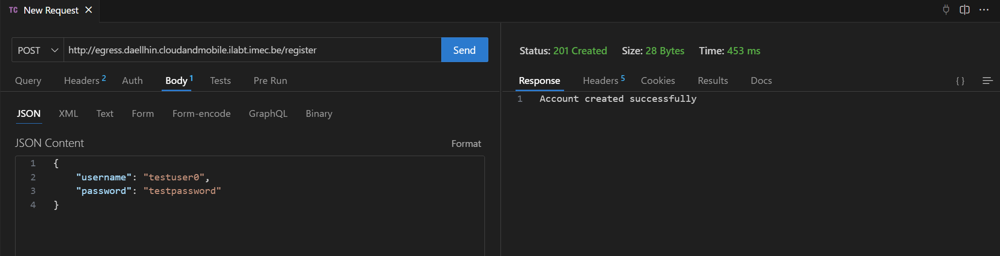
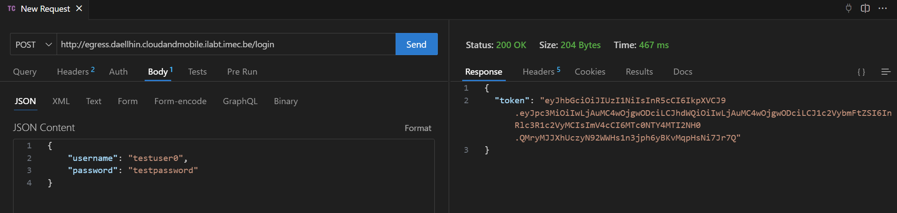
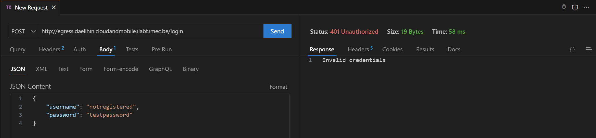

# Lab5 Egress: Part 2 - Securing Web Services
Lorin Speybrouck

## Tasks
### Task 1: Configure JWT
`Code`
```kotlin
// Auth.kt
private fun Application.configureAuth() {
    install(Authentication) {
        jwt("auth-jwt") {
            verifier(
                JWT
                    .require(Algorithm.HMAC256(SessionManager.secret))
                    .withIssuer(SessionManager.issuer)
                    .withAudience(SessionManager.audience)
                    .build()
            )
            validate { credential ->
                if (credential.payload.getClaim("username").asString().isNotEmpty()) 
                    JWTPrincipal(credential.payload)
                 else 
                    null
            }
            challenge { _, _ ->
                call.respond(
                    status = HttpStatusCode.Unauthorized,
                    message = "Invalid or missing token"
                )
            }
        }
    }
}
```
In the first task the verifier, validate and challenge functions have been completed. 
- **verifier**: The verifier function configures the JWT validation by specifying the expected algorithm, issuer, and audience for incoming tokens.
- **validate**: The validate function checks if the JWT contains a non-empty "username" claim and, if so, authenticates the user by creating a JWTPrincipal.
- **challenge**: The challenge function defines the response sent to the client when authentication fails, returning an HTTP 401 Unauthorized status with an error message.

### Task 2: Add a registration endpoint
`Result:` successful registration


`Result:` already registered


`Code`
```kotlin
// Auth.kt
post("/register") {
	val credentials = call.receive<SessionManager.Credentials>()
	val result = SessionManager.createAccount(credentials)

	result.fold(
		onSuccess = {
			call.respond(HttpStatusCode.Created, "Account created successfully")
		},
		onFailure = { exception ->
			when (exception) {
				is SessionManager.AlreadyExists -> call.respond(HttpStatusCode.Conflict, "Username already taken")
				else -> call.respond(HttpStatusCode.InternalServerError, "Failed to create account")
			}
		}
	)
}
```
```kotlin
// SessionManager.kt
suspend fun createAccount(credentials: Credentials): Result<Unit> {
	LOGGER.info("Incoming register attempt for `${credentials.username}`")
	return try {
		// Check if the username already exists in the database
		val userExists = UserManager.check(credentials.username, credentials.password)
		if (userExists)
			return Result.failure(AlreadyExists)

		// Create the user account in the database
		UserManager.create(credentials.username, credentials.password)
		Result.success(Unit)
	} catch (e: Exception) {
		LOGGER.error("Error creating account for `${credentials.username}`: ${e.message}")
		Result.failure(e)
	}
}
```
When the register POST endpoint is called the function gets the credentials from the body, and passes them to the SessionManager to create a account. If this is successful the response is a create HTTP status code and a succes message. If unsuccessful the error is reported, either it conflicts wit a existing account, or there was a server error.

In the create account function we first check with the UserManager if an account with the specified credentials exists. If not a account is created.

### Task 3: Add a login endpoint
`Result:` successful login


`Result:` not registered


`Code`
```kotlin
// Auth.kt
post("/login") {
	val credentials = call.receive<SessionManager.Credentials>()
	val result = SessionManager.processLogin(credentials)

	result.fold(
		onSuccess = { token ->
			call.respond(HttpStatusCode.OK, token)
		},
		onFailure = { exception ->
			when (exception) {
				is SessionManager.InvalidCredentials -> call.respond(HttpStatusCode.Unauthorized, "Invalid credentials")
				else -> call.respond(HttpStatusCode.InternalServerError, "Failed to process login")
			}
		}
	)
}
```
```kotlin
// SessionManager.kt
suspend fun processLogin(credentials: Credentials): Result<Token> {
	LOGGER.info("Incoming login attempt for `${credentials.username}`")
	return try {
		val isValid = UserManager.check(credentials.username, credentials.password)
		if (!isValid) {
			return Result.failure(InvalidCredentials)
		}

		val token = JWT.create()
			.withIssuer(issuer)
			.withAudience(audience)
			.withClaim("username", credentials.username)
			.withExpiresAt(Date(System.currentTimeMillis() + expiry))
			.sign(Algorithm.HMAC256(secret))

		Result.success(Token(token))
	} catch (e: Exception) {
		LOGGER.error("Error during login for `${credentials.username}`: ${e.message}")
		Result.failure(e)
	}
}
```
When the login POST endpoint is called the function gets the credentials from the body, and passes them to the SessionManager to verify. If successful the JWT token is returned. If unsuccessful the reason is returned, invalid credentials, or server error.

In The processLogin function the credentials are checked in the database using the UserManager. If successful a JWT token will be created using HMAC256 for the given username.

### BONUS Task 4: Implement IP ban or backoff to prevent attacks
`Code`
```kotlin
// Backoff.kt
val BackoffPlugin = createApplicationPlugin("BackoffPlugin") {
    onCall { call ->
        // Check if the host is rate-limited
        if (RateLimiter.isRateLimited(call)) {
            call.respond(HttpStatusCode.TooManyRequests, "You are temporarily banned due to repeated invalid requests.")
            return@onCall
        }
    }
    onCallRespond { call, statusCode ->
        // Observe responses and handle bad calls
        if (statusCode == HttpStatusCode.Unauthorized || statusCode == HttpStatusCode.BadRequest) {
            RateLimiter.onBadCallMade(call)
        }
    }
}
```
In the onCall function of the BackoffPlugin RateLimiter determines if the user is rate limited. If this is the case the function responds with a message with TooManyRequests code.

In the onCallRespond function the onBadCallMade function is called if the user sends a BadRequest or is Unauthorized(invalid credentials), this will then internally decrease the amount of attempts the user has before being banned.

## Questions
### Question 1
> From a consumer point-of-view, e.g., a mobile app that wants to visualize the sensors exposed by the egress API, what has changed in the requests they make between the version of the egress API in Part1 and the extended version from this lab session (Part2)?

When a user now calls a endpoint he needs to pass a valid JWT token. For this he has to create an account using the /register endpoint. After that he needs to call /login using the same credentials to get the token.

### Question 2
> How would you protect the /register endpoint to prevent account creation spam as much as possible?

To protect the /register endpoint we can add multiple checks. For example:
- Rate limiting per account or IP address(max n requests per minute)
- Email verification with confirmation links

### Question 3
> How would you handle banning users, meaning, revoking their tokens?

To revoke tokens from the user we will need to store the token(s) linked to a user in the database. Then when a users logs in we check if the token is not revoked. 
