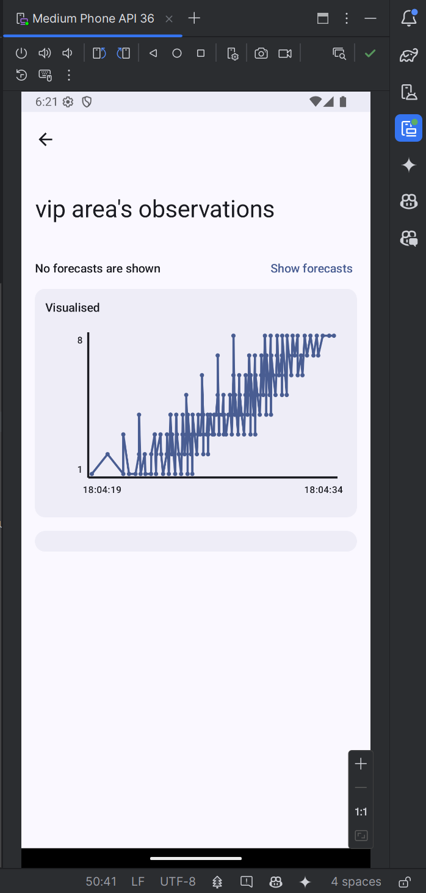

<style>
img {
	max-width: 300px !important; 
}
code {
    background-color: #e0e0e0; /* Light gray background */
    padding: 2px; /* Add padding */
    border-radius: 4px; /* Rounded corners */
}
</style>

# Lab6 Mobile Development with Kotlin
Lorin Speybrouck

## Tasks
### Task 0: Running the app
`Result`  


After changing the egress url to the correct value the app shows the login screen.

### Task 1: Authentication
`Result:` see __task1.mp4__ for a full overview

`Code:`
```kotlin
// UserSession.kt
private suspend fun login(credentials: Credentials): Result<User> {
	return runCatching {
		val response = httpClient.post(Egress.login) {
			contentType(ContentType.Application.Json)
			setBody(credentials)
		}
		if (response.status != HttpStatusCode.OK) {
			throw Exception("Login failed with status: ${response.status}")
		}
		response.body<User>()
	}
}
private suspend fun register(credentials: Credentials): Result<Unit> {
	return runCatching {
		val response = httpClient.post(Egress.register) {
			contentType(ContentType.Application.Json)
			setBody(credentials)
		}
		if (response.status != HttpStatusCode.OK) {
			throw Exception("Register failed with status: ${response.status}")
		}
		Unit
	}
}
```
For the register function a HTTP post request is made to the register endpoint. This uses the the credentials as body, in Json format. To notify that the body is Json type the content type is set to Json. If the response to the register request is not OK(400) the function returns an exception, which combined with the runCatching wil create a error result.

For the login function the same steps are used as the register function. The only difference is that when the response is OK the return value of the function is the token from the response.

### Task 2: Sources overview
`Result:`  


`Code`
```kotlin
// SourcesService.kt
private val _sources = MutableStateFlow<List<String>>(emptyList())

@Serializable
data class SourcesResponse(
	val sources: List<String>
)
fun refresh() {
	scope.launch {
		try {
			val response = context.userSession.authorizedRequest {
				url(Egress.sources)
				method = HttpMethod.Get
			}

			if (response.status != HttpStatusCode.OK) {
				throw Exception("Failed to get sources: ${response.status}")
			}

			val sources = response.body<SourcesResponse>().sources
			_sources.update { sources }
		} catch (e: Exception) {
			_errors.emit(e)
		}
	}
}
```
For maintaining the sources a state flow is used. This means the current value of the sources can always be retrieved, because a state flow remembers the current state and notifies when this has changed. This is most appropriate for the source as the do not change frequently (only when a new device is added), and then the user can refresh manually. To make sure the main thread is not blocked, the network request is called in a coroutine. Inside this the authorizedRequest function is used so that the token is automatically applied. To get the sources a GET request is made to the sources endpoint. If the request is successful the state flow can be updated. Otherwise a exception is thrown, which wil be caught and added to the errors flow.

### Task 3: Counts & forecast
`Result:`  



`Code CountsService`
```kotlin
// CountsService.kt
@Serializable
data class Response(
	val events: List<Event>
) {
	@Serializable
	data class Event(
		val timestamp: Long,
		val value: Int,
		val source: String?
	)
}
fun observe(
	source: String,
	interval: Duration = 30.minutes,
	period: Duration = 20.seconds
): Flow<List<Response.Event>> {
	return flow {
		while (true) {
			try {
				val now = Clock.System.now()
				val response = context.userSession.authorizedRequest {
					url(Egress.counts(now - interval, now, source))
					method = HttpMethod.Get
				}

				if (response.status != HttpStatusCode.OK) {
					throw Exception("Failed to retrieve counts from source '${source}': ${response.status}")
				}

				val events = response.body<Response>().events

				emit(events)
				delay(period)
			} catch (e: Exception) {
				_errors.emit(e)
			}
		}
	}
}
```
To get the counts a regular flow is used. This implicitly uses a coroutine, again to not block the main thread. Inside the flow a infinite loop is entered that executes and then waits a variable delay (default 20s). In the loop a authorizedRequest is made to the counts endpoint using the given parameters. If the respons is successful the events are parsed as Response Json andd are emitted on the flow.

`Code ForecastService`
```kotlin
// ForecastService.kt
@Serializable
data class Response(
	val source: String,
	val method: String,
	val predictions: List<Prediction>
) {
	@Serializable
	data class Prediction(
		val timestamp: Long,
		val value: Int,
	)
}
fun observe(
	source: String,
	period: Duration = 20.seconds
): Flow<List<Response.Prediction>> {
	return flow {
		while (true) {
			try {
				val now = Clock.System.now()
				val response = context.userSession.authorizedRequest {
					url(Egress.forecast(now, source))
					method = HttpMethod.Get
				}

				if (response.status != HttpStatusCode.OK) {
					throw Exception("Failed to get forecasts from source '${source}': ${response.status}")
				}

				val predictions = response.body<Response>().predictions

				emit(predictions)
				delay(period)
			} catch (e: Exception) {
				_errors.emit(e)
			}
		}
	}
}
```
The forecasts service works in same way as the counts service, but uses the forecast endpoint.

### Task 4: Attendance
`Result`  


`Code`
```kotlin
// Observations.kt
val attendanceData = remember(source) {
	attendanceService.observe(source = source)
}
AttendanceWidget(
	flow = attendanceData,
	modifier = Modifier.padding(horizontal = 16.dp)
)

// Attendance.kt
@Composable
fun formatTimeAgo(timestamp: Long): String {
    val eventTime = Instant.fromEpochMilliseconds(timestamp)
    val now = System.now()
    val duration = now - eventTime
    return when {
        duration.inWholeSeconds < 60 -> "${duration.inWholeSeconds} seconds ago"
        duration.inWholeMinutes < 60 -> "${duration.inWholeMinutes} minutes ago"
        duration.inWholeHours < 24 -> "${duration.inWholeHours} hours ago"
        else -> "${duration.inWholeDays} days ago"
    }
}
@Composable
fun AttendanceWidget(
    flow: Flow<List<AttendanceEvent>>,
    modifier: Modifier = Modifier
) {
    Column(
        modifier = modifier
            .fillMaxWidth()
            .clip(RoundedCornerShape(12.dp))
            .background(MaterialTheme.colorScheme.surfaceColorAtElevation(2.dp))
            .padding(12.dp)
    ) {
        Text(
            text = "Changes ",
            style = MaterialTheme.typography.labelLarge
        )

        val data = flow.collectAsState(initial = emptyList())
        data.value.forEach { event ->
            Row(
                modifier = Modifier.padding(vertical = 8.dp),
            ) {
                Icon(
                    imageVector = if (event.arrival) Icons.Default.GroupAdd else Icons.Default.GroupRemove,
                    contentDescription = "Observation Icon",
                    modifier = Modifier.padding(end = 8.dp)
                )
                Column {
                    Text(
                        text = event.id,
                        style = MaterialTheme.typography.bodyLarge,
                        maxLines = 1,
                        overflow = TextOverflow.Ellipsis
                    )
                    Text(
                        text = formatTimeAgo(event.timestamp),
                        style = MaterialTheme.typography.bodySmall
                    )
                }
            }
        }
    }
}
```
The attendance functionality is added inside the Attendance.kt file where the AttendanceWidget composable is defined. This includes a column which acts as the card with the gray background. Inside this the passed flow is observed and iterated over. This creates per element a row with an Icon, the ID and the timestamp. To format the timestamp the formatTimeAgo function is used. This formats the timestamp to `time x ago` where the time is rounded to seconds, minutes, hours or days. 

## Extra tasks
### Extra 1 and 2: Disable login/register
`Result:` see __task-extra-login.mp4__ for a full overview

`Code`
```kotlin
// Authentication.kt
TextField(
	label = { Text("Username") },
	value = username,
	onValueChange = { username = it },
	modifier = Modifier.fillMaxWidth(),
	isError = username.contains(" "),
	singleLine = true
)
Spacer(modifier = Modifier.height(8.dp))
TextField(
	label = { Text("Password") },
	value = password,
	onValueChange = { password = it },
	modifier = Modifier.fillMaxWidth(),
	visualTransformation = PasswordVisualTransformation(),
	isError = password.contains(" "),
	singleLine = true
)
Spacer(modifier = Modifier.height(8.dp))
Row(
	modifier = Modifier.fillMaxWidth(),
	horizontalArrangement = Arrangement.SpaceBetween
) {
	val session = getUserSession()
	var enabled by remember { mutableStateOf(true) }
	TextButton(
		enabled = enabled &&
				username.isNotEmpty() && !username.contains(" ") &&
				password.isNotEmpty() && !password.contains(" "),
		onClick = {
			enabled = false
			val credentials = Credentials(
				username = username,
				password = password
			)
			session.register(
				credentials = credentials,
				onSuccess = { enabled = true },
				onFailure = { enabled = true }
			)
		}
	) { Text(text = "Register") }
	Button(
		enabled = enabled &&
				username.isNotEmpty() && !username.contains(" ") &&
				password.isNotEmpty() && !password.contains(" "),
		onClick = {
			enabled = false
			val credentials = Credentials(
				username = username,
				password = password
			)
			session.login(
				credentials = credentials,
				onSuccess = { enabled = true },
				onFailure = { enabled = true }
			)
		}
	) { Text(text = "Login") }
}
```
- On the Authentication page the username and password field now show an error(red border) when they contain a space
- The login and register buttons are now only enabled when the username and password fields dont contain a space and they are not empty
- The username and password fields also dont accept newlines anymore, this was done by setting `singleLine = true`

### Extra 3: Token persistence
`Result:` see __task-extra-persistence.mp4__ for a full overview

`Code`
```kotlin
// MainActivity.kt
override fun onCreate(savedInstanceState: Bundle?) {
	super.onCreate(savedInstanceState)
	userSession.loadToken()
	setContent {
		OCMTTheme {
			Root()
		}
	}
}
// UserSession.kt
fun loadToken() {
	scope.launch {
		val sharedPreferences = context.getSharedPreferences("user_session", Context.MODE_PRIVATE)
		val savedToken = sharedPreferences.getString("session_token", null)
		if (!savedToken.isNullOrEmpty()) 
			_state.emit(User(token = savedToken))
	}
}
fun login(
	credentials: Credentials,
	onSuccess: () -> Unit,
	onFailure: () -> Unit
) {
	scope.launch {
		login(credentials)
			.onFailure { onFailure() }
			.onFailure { _errors.emit(it) }
			.onSuccess { session ->
				val sharedPreferences = this@UserSession.context.getSharedPreferences("user_session", Context.MODE_PRIVATE)
				sharedPreferences.edit { putString("session_token", session.token) }
				_state.emit(session)
				onSuccess()
			}
	}
}
fun logout() {
	val sharedPreferences = context.getSharedPreferences("user_session", Context.MODE_PRIVATE)
	sharedPreferences.edit { remove("session_token") }
	_state.update { null }
}
```
The token persistence is implemented in the UserSession class. Here a new function loadToken was created which is called by the main activity in the onCreate function. This had to be done because the context needs to be initialized before accessing the shared preferences. In the loadToken function the shared preferences of the user_session are retrieved, where the session_token variable is gotten from. If it exists the token is used to create a user which is then emitted over the stateFlow. In the login function now we a successful login happens the sharedPreferences are updated to save the token. If the user logs out the token is removed.

### Extra 3: Time
`Result:` see __task-extra-time.mp4__ for a full overview

`Code`
```kotlin
// Pickers.kt
@Composable
fun TimeInput(onChange: (Instant?) -> Unit, textContent: @Composable (String?) -> Unit) {
    var showDatePicker by remember { mutableStateOf(false) }
    var showTimePicker by remember { mutableStateOf(false) }

    var timePickerState = rememberTimePickerState(
        initialHour = Calendar.getInstance().get(Calendar.HOUR_OF_DAY),
        initialMinute = Calendar.getInstance().get(Calendar.MINUTE),
        is24Hour = true
    )
    var datePickerState = rememberDatePickerState()

    var value by remember { mutableStateOf<Instant?>(null) }

    if (showDatePicker) {
        DatePickerModal(
            onConfirm = { newDatePickerState ->
                datePickerState = newDatePickerState
                showDatePicker = false
                showTimePicker = true
            },
            onDismiss = { showDatePicker = false },
            datePickerState
        )
    }
    if (showTimePicker) {
        TimePickerModal(
            onConfirm = { newTimePickerState ->
                value = datePickerState.selectedDateMillis?.let { dateMillis ->
                    val calendar = Calendar.getInstance().apply {
                        timeInMillis = dateMillis
                        set(Calendar.HOUR_OF_DAY, timePickerState.hour)
                        set(Calendar.MINUTE, timePickerState.minute)
                        set(Calendar.SECOND, 0)
                        set(Calendar.MILLISECOND, 0)
                    }
                    Instant.fromEpochMilliseconds(calendar.timeInMillis)
                }
                onChange(value)
                timePickerState = newTimePickerState
                showTimePicker = false
            },
            onDismiss = { showTimePicker = false },
            timePickerState
        )
    }

    Row(
        verticalAlignment = Alignment.CenterVertically
    ) {
        val formattedStart = value?.let {
            val formatter = SimpleDateFormat("dd-MM-yyyy HH:mm", Locale.getDefault())
            formatter.format(it.toEpochMilliseconds())
        }
        textContent(formattedStart)
        Spacer(modifier = Modifier.weight(1f))
        TextButton(
            onClick = { showDatePicker = true },
            modifier = Modifier.padding(horizontal = 16.dp)
        ) {
            Text("Edit")
        }
    }
}
@Composable
fun TimePickerModal(
    onConfirm: (TimePickerState) -> Unit,
    onDismiss: () -> Unit,
    initialTimePickerState: TimePickerState? = null
) {
    val timePickerState = initialTimePickerState ?: rememberTimePickerState(
        initialHour = Calendar.getInstance().get(Calendar.HOUR_OF_DAY),
        initialMinute = Calendar.getInstance().get(Calendar.MINUTE),
    )

    AlertDialog(
        onDismissRequest = onDismiss,
        dismissButton = {
            TextButton(onClick = { onDismiss() }) {
                Text("Dismiss")
            }
        },
        confirmButton = {
            TextButton(onClick = { onConfirm(timePickerState) }) {
                Text("OK")
            }
        },
        text = {
            TimePicker(
                state = timePickerState,
            )
        }
    )
}
@Composable
fun DatePickerModal(
    onConfirm: (DatePickerState) -> Unit,
    onDismiss: () -> Unit,
    initialDatePickerState: DatePickerState? = null
) {
    val datePickerState = initialDatePickerState ?: rememberDatePickerState()

    DatePickerDialog(
        onDismissRequest = onDismiss,
        confirmButton = {
            TextButton(onClick = {
                onConfirm(datePickerState)
                onDismiss()
            }) {
                Text("OK")
            }
        },
        dismissButton = {
            TextButton(onClick = onDismiss) {
                Text("Cancel")
            }
        }
    ) {
        DatePicker(state = datePickerState)
    }
}
```
To be able to change the start and end timestamp I added date and time pickers. When the user wants to change one of the timestamp first a datepicker dialog is launched and after that a timepicker dialog is opened. After this a instant is created from these two values.

```kotlin
// Observations.kt
var start by remember { mutableStateOf<Instant?>(null) }
var end by remember { mutableStateOf<Instant?>(null) }
Column(modifier = Modifier.padding(start = 16.dp, end = 16.dp, bottom = 16.dp)) {
	TimeInput(
		onChange = { start = it },
		textContent = { formattedText ->
			Text(text = "Start: ${formattedText ?: "Now-30m"}")
		}
	)
	TimeInput(
		onChange = { end = it },
		textContent = { formattedText ->
			Text(text = "End: ${formattedText ?: "Now"}")
		}
	)
}

val countsService = getCountsService()
val forecastService = getForecastService()
val attendanceService = getAttendanceService()
val countsData = remember(source, start, end) {
	countsService.observe(source, start, end)
		.map { it.map { Instant.fromEpochMilliseconds(it.timestamp) to it.value } }
}
val forecastData = remember(source, start) {
	forecastService.observe(source, start)
		.map { it.map { Instant.fromEpochMilliseconds(it.timestamp) to it.value } }
}
val attendanceData = remember(source, start, end) {
	attendanceService.observe(source, start, end)
}
```
The pickers are added to the observations screen using the TimeInput composable. This has two parameters one that is used to update the timestamp in a callback and the other the text that should be displayed when the picker is not opened. I also modified the services to take a optional start and end timestamp, so when no timestamps are provided it stil uses the old functionality and when timestamps are provided it uses these to narrow the search. The query to fetch the new data from a specified timestamp is executed immediately because the remember function also has the start and end variables. This means that if one of these values changes the function it contains is reexecuted.

## Questions
### Question 1
> If you had more time, what else would you like to add to your mobile application?

If i had more time I would have liked to add the following features
- Add a icon or picture per source: by editing the sources GET request so that it includes a picture URL. This would make the home page more interesting and make sources easily distinguishable
- Add week/day/month view: below changes I would add another card with information per day/week/month with the amount of unique people in building at that time period. This is not possible to see in the graph as it does not distinguish uniqueness
- Search options: I would add a search box for the sources and a search box for specific IDs in the observations screen
- Refresh observation now button: 

### Question 2
> If you toggle between hiding and showing forecasts in the observations detail screen, you can see the graph ”flicker”. Why do you think that is? How would you fix this?

The flicker happens because toggling the forecast visibility causes the graph component to be recomposed or recreated, which resets its internal state and triggers a redraw. This can happen if the data or the entire graph widget is conditionally included/excluded from the UI tree, causing a full teardown and rebuild.

Instead of conditionally creating/destroying the graph, always keep the graph component in the composition and only toggle the visibility of the forecast data within the graph.
