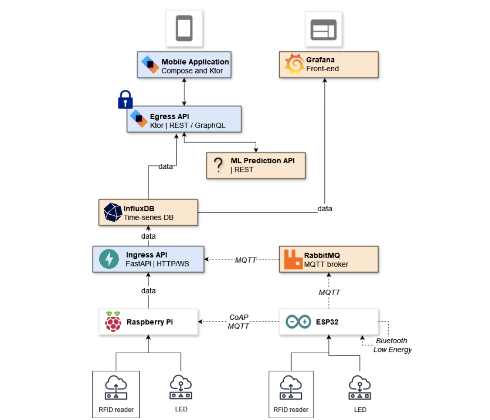

# Cloud and mobile
Contains all assignments, C/Python/Kotlin code and reports for the CloudAndMobile labs

## Labs
- [Lab1 SensorsAndActuators](<Lab1 SensorsAndActuators/README.md>)
- [Lab2 Lab2 FastAPl](<Lab2 FastAPI/README.md>)
- [Lab3 Microservices](<Lab3 Microservices/README.md>)
- [Lab4 IntegrationPatterns](<Lab4 IntegrationPatterns/README.md>)
- [Lab5.1 RESTAndGraphQL](<Lab5.1 RESTAndGraphQL/README.md>)
- [Lab5.2 SecuringWebServices](<Lab5.2 SecuringWebServices/README.md>)
- [Lab6 MobileApp](<Lab6 MobileApp/README.md>)

## Created stack 

